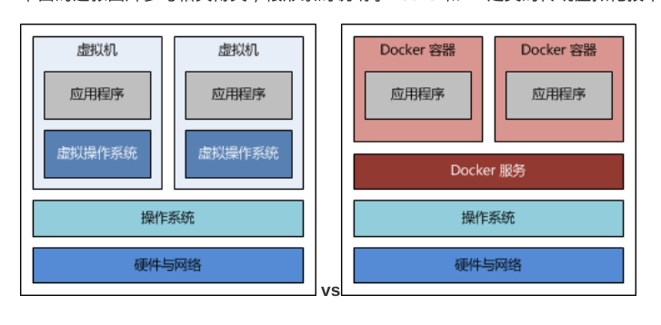
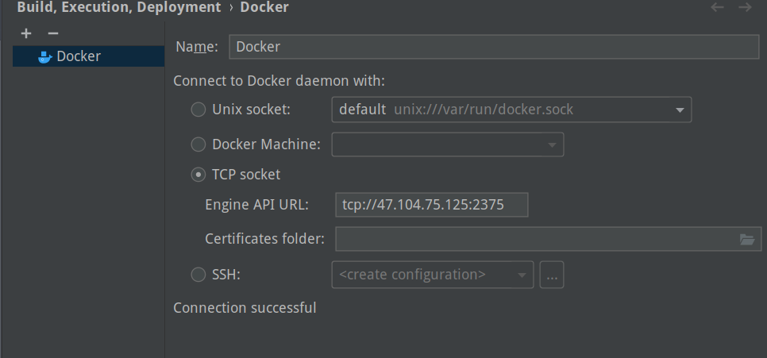

## 概念

docker就是不包括内核的虚拟机，在原内核基础上，由docker进程控制一个个容器，里面装着环境（app+lib）



镜像就像是iso文件，容器就像是虚拟机

如果是倒腾着玩或者只是当个虚拟机快照，以下两条都是屁话，ssh连就完事，vscode下个remote-ssh就可以愉快玩耍了，反正不是又不是正经的部署项目，管那么多干嘛

Docker倡导 的一个容器一个进程的原则。为了尽量的轻量快捷建议一个容器尽量只有一个进程，即不建议ssh连接（需要sshd进程）

**一次性** ：容器本身是一个无状态，用后即焚的东西，创建后应该是被视为不可改变的

## 安装Docker

> docker 分为 docker-ce（原docker）的社区版和docker-ee（原docker -engine）

> centos8 下yum install docker命令 下的不是docker，而是redhat出版的类似docker的podman（好不好用我不说，但是很狗就是了）
>
> docker desktop 是在windows或mac下运行虚拟机或wsl里的docker的工具，不想搞虚拟机，我不装

不同版本方法不同

centos8:

```shell
curl https://download.docker.com/linux/centos/docker-ce.repo -o /etc/yum.repos.d/docker-ce.repo
yum install docker-ce -y
```

非root用户免sudo操作docker：

```
sudo usermod -aG docker $USER
```

## 启动服务

systemctl  stop， start ，restart  docker，老三样

## 镜像管理

- 搜索镜像(按start排的)

  ```
  docker search xxx
  ```

- 下载镜像

  ```
  docker pull XXX
  ```

  - 下是不可能下得动的，得换源

    ```
    cd /etc/docker
    vim daemon.json
    ```

    ```
    {
      "registry-mirrors": [
        "https://hub-mirror.c.163.com",
        "https://ustc-edu-cn.mirror.aliyuncs.com",
        "https://ghcr.io",
        "https://mirror.baidubce.com"
      ]
    }
    ```

    ```
    service docker restart
    ```

- 查看已有镜像

  ```
  docker images
  ```

- 显示完整镜像id

  ```
  docker images --no-trunc
  ```

- 移除本地镜像

  ```
  docker rmi [镜像id...]
  ```

- 镜像文件路径(pull操作)：`/var/lib/docker/containers`

- 镜像->镜像tar包

  ```
  docker save -o xxx.tar 镜像名 
  ```

  镜像tar ->镜像

  ```
  docker load -i xxx.tar
  ```

## 容器管理

- 新建并启动容器 ： 80 为本地映射端口  (-d 参数后台运行)

  ```shell
  docker run -it --name webdemo -p 80:8080 tomcat /bin/bash
  ```

  docker 要想开启ssh连接，需要systemctl，而systemctl需要访问内核，所以在启动参数里添加需要特权`--privileged=true`，还有个用于启动dbus-daemon的参数`/usr/sbin/init`（会跑码，记得后台 -d）

  （这就是违背docker理念的下场，docker是不推荐额外添加进程的）

  ```
  docker run -itd --name centos7 -p 1234:22 --privileged=true centos:7  /usr/sbin/init
  ```

  一篇大佬的博客https://www.cnblogs.com/jesse131/p/13543308.html讲了怎么开启ssh，下面是他的使用dockerfile生成可ssh的centos7镜像的命令：

  ```
  docker build -t linux git@github.com:Jesse121/mylinux.git
  ```

- doker执行命令（只能执行简单的命令，痛过）

  ```
  docker exec [容器名/id] ls
  ```

- 进入正在运行的容器

  ```
  1.命令格式一：docker exec -it [容器名/id] /bin/bash，（好！，起新进程连接，就像是ssh，生产环境最常用这个，exit退的是自己）
  2.命令格式二：docker attach [容器名/id]（不好！，相当于投屏输出，exit退的是容器（ssh连接除外，尽管不推荐ssh连接，很不专业））
  ```

- 查看正在运行的容器

  ```
  docker ps 		
  ```

  查看所有容器（包括不在运行的）

  ```
  docker ps -a
  ```

- 容器改名

  ```
  docker rename  oldname newname
  ```
  
- 传递文件

  - 向容器内传

    ```
    docker cp XXX.war  [容器名/id]:/usr/local/tomcat/webapps
    ```

  - 向容器外传

    ```
    docker cp [容器名/id]:/usr/local/tomcat/webapps/xxx  .  
    ```

- 启动容器

  ```
  docker start [容器名/容器id]
  ```

- 重启容器

  ```
  docker restart [容器名/容器id]
  ```

- 停止容器

  ````
  docker stop [容器名/容器id]
  docker kill [容器名/容器id] #强制
  ````

- 退出容器(交互式)

  ```
  1.容器停止并退出：exit 
  
  2.容器不停止退出: ctrl+P+Q(非ssh的attach连接只能以这种方式退出)
  ```

- 删除容器

  ```
  docker rm [容器名/容器id]
  ```

- 容器 ->容器tar

  ```
  docker export -o xxx.tar [容器名/容器id]
  ```

  容器tar->镜像

  ```
  docker import xxx.tar [容器名/容器id]
  ```

## 生成镜像

- 根据某个容器id生成镜像

```
docker commit [容器名/容器id]   name:version
```

- build

```
 docker build -t name:version
# -t : tag标记镜像名和状态
```

## 上传镜像

- 注册Dockerhub账号：https://hub.docker.com/

- 登录自己的dockerhub账号

  

- 使用`docker tag 镜像名 用户名称/镜像源名(repository name):新的标签名(tag)` 为镜像改名（不改不行）

  

- docker push

  

## 多容器协作

docker compose是由docker官方制作的，需要单独下载

```
sudo curl -L https://github.com/docker/compose/releases/download/1.27.4/docker-compose-`uname -s`-`uname -m` > /usr/local/bin/docker-compose

# 国内用户可以使用以下方式加快下载
sudo curl -L https://download.fastgit.org/docker/compose/releases/download/1.27.4/docker-compose-`uname -s`-`uname -m` > /usr/local/bin/docker-compose

sudo chmod +x /usr/local/bin/docker-compose
```

它允许用户通过一个单独的 `docker-compose.yml` 模板文件（YAML 格式）来定义一组相关联的应用容器为一个项目（project）。

例如：web服务容器，和数据库服务容器，有效分离应用逻辑和数据的有效分离

编辑docker_compose.yml 文件

```yml
version: '3'

services:
  web: 
    build: .
    ports:
      - "80:8080"
  db:
    image: "mysql"
    environment:
      MYSQL_DATABASE: dbname
      MYSQL_ROOT_PASSWD: psd
    volumes:
      - my-volumesname:/var/lib/mysql
volumes:
   my-volumesname: 
```

使用

```
docker compose up -d  #启动所有容器
docker compose down   #停止并删除所有容器
docker compose down --volumes  #停止并删除所有容器及数据卷
```

## 部署

- #### 传统方式

  将jar包和Dockerfile放到服务器上同一个文件夹，build，run

- #### idea快速连接

  - ```
    vim /usr/lib/systemd/system/docker.service
    ```

  - 添加以下内容（注释原ExecStart）

    ```
    ExecStart=/usr/bin/dockerd -H tcp://0.0.0.0:2375 -H unix:///var/run/docker.sock 
    ```

  - idea `settings->docker` (连网服务器CA证书最好有)

    
  - CA证书

    - 创建个CA文件夹

    ```
    mkdir -p /usr/local/ca
    cd /usr/local/ca/
    ```

    - 生成CA公钥和私钥
    
    ```
    openssl genrsa -aes256 -out ca-key.pem 4096 #创建密码
    
    openssl req -new -x509 -days 365 -key ca-key.pem -sha256 -out ca.pem #依次输入密码、国家、省、市、组织名称等
    
    openssl genrsa -out server-key.pem 4096
    
    openssl req -subj "/CN=$HOST" -sha256 -new -key server-key.pem -out server.csr
    
    echo subjectAltName = IP:121.40.176.56,IP:0.0.0.0 >> extfile.cnf
    
     echo extendedKeyUsage = serverAuth >> extfile.cnf
     
     openssl x509 -req -days 365 -sha256 -in server.csr -CA ca.pem -CAkey ca-key.pem \-CAcreateserial -out server-cert.pem -extfile extfile.cnf
    
    openssl genrsa -out key.pem 4096
    
    openssl req -subj '/CN=client' -new -key key.pem -out client.csr
    
    echo extendedKeyUsage = clientAuth >> extfile.cnf
    
    openssl x509 -req -days 365 -sha256 -in client.csr -CA ca.pem -CAkey ca-key.pem \-CAcreateserial -out cert.pem -extfile extfile.cnf
    
    rm -v client.csr server.csr
    
    chmod -v 0400 ca-key.pem key.pem server-key.pem
    
    chmod -v 0444 ca.pem server-cert.pem cert.pem
    
    cp server-*.pem  /etc/docker/
    
    cp ca.pem /etc/docker/
    
    vim /lib/systemd/system/docker.service
    ```
    
  
  
  
  ```
            --tlsverify --tlscacert=/etc/docker/ca.pem \
            --tlscert=/etc/docker/server-cert.pem \
            --tlskey=/etc/docker/server-key.pem \
            -H tcp://0.0.0.0:2375 -H unix:///var/run/docker.sock 
  ```
  
  ```
  systemctl daemon-reload 
  systemctl restart docker
  
  # scp  ca.pem cert.pem key.pem 到本地docker-ca文件夹
  ```
  
  完成

## 补充：

要修改端口映射，三个方法：1.删了重建重启动，2.旧docker commit到新启动 ，3改配置，最麻烦的

Docker容器后台运行,就必须有一个前台进程。容器运行的命令如果不是那些一直挂起的命令（比如运行top，ping），就是会自动退出的（如/bin/bash）。

docker export/import与docker save/load的区别：
export/import会丢弃历史记录和元数据信息，仅保存容器当时的快照状态
save/load会保存完整记录，体积更大
