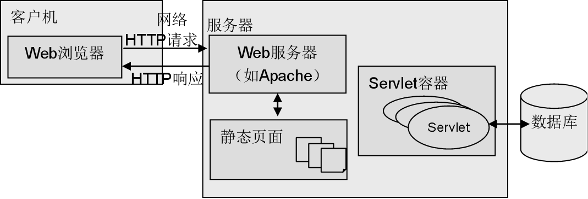
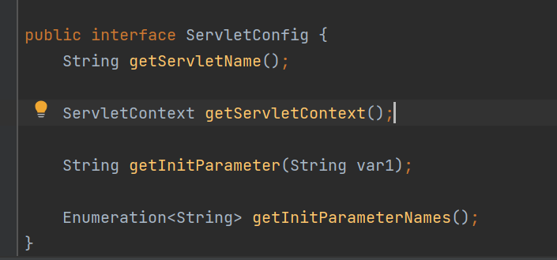
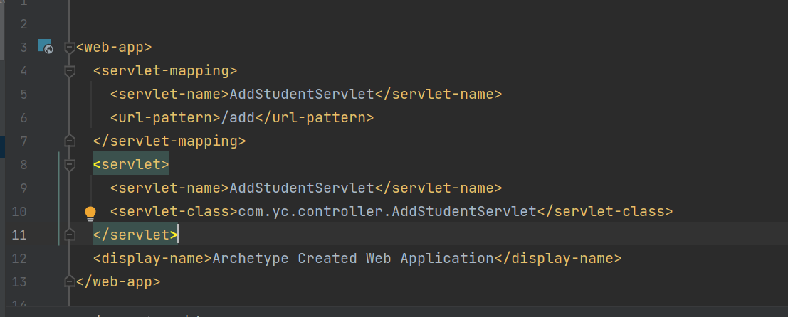
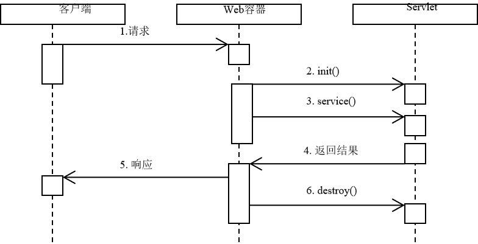

## JavaEE

JavaEE全称Java Platform, Enterprise Edition，是对javaSE的扩展，加入了对web和网络的有关支持(Servlet，websocket等),即javaEE=javaSE+更多的jar包 ， javaweb就是添加了servlet这个jar包的来实现网络编程的web应用，属于javaee的一部分


## 项目结构


这是使用了maven了的普通javaweb项目结构，其中com.xxx包下就是我们写代码的地方，我们可以创建controller文件夹写servlet类，创建dao文件夹来写与数据库的交互，创建domain文件夹来写业务实体类，创建utils来写工具，....

个人感觉，这里最重要的是servlet类

webapp是你的前端的一些东西，当然，这里说的前端是java实现的前端，前后端分离的以后再写

个人感觉，这里最重要的是web-inf里的web-xml

##  Servlet和ServletContainer（java怎么接收请求？响应？）

Servlet API是用于处理http请求的api（Application Programming  **Interface**），HttpServlet实现了这个接口的部分方法（其实中间还隔着个GenericServlet），一般在实际项目开发中，都是使用继承HttpServlet类的方式去实现Servlet程序。而我们自定义的类也继承了这个HttpServlet，我们可以实现剩下的那部分方法（如最常用的post和get方法）。


我们要基于Servlet Container（tomcat，apache等）才可以运行Servlet程序（springboot除外，他比较牛逼，他把container功能都给实现了），提一嘴，Tomcat也是java实现的

写Java主流的都是Tomcat，Tomcat是web服务器和servlet容器的结合，web服务器负责接收request和返回response（怎么实现呢？自己看计算机网络方面的知识去），servelt容器里放着很多servlet有关对象，包括上面自定义的那个。

**流程**：Tomcat将获得的http请求解析，并封装实例化成HttpServletRequest对象，我们自定义的servlet可以操作这个对象，可以获得该对象的各个属性，待我们处理完业务，再把要返回的数据加到Tomcat给的HttpServletResponse对象里，Tomcat将HttpServletResponse对象解析成response发给浏览器



我们只要根据请求类别的不同（常见也就post，get），写个继承了HttpServlet类的自定义Servlet类并重写dopost()和doget()方法就好了，至于接收请求，调用方法，返回响应都由Tomcat搞定

下面这张图能看懂这些是啥，你就算知道Servlet了


## ServletConfig类 和web.xml（跳转页面的实现）

HttpServlet的父类GenericServlet，除了Servlet还实现了个ServletConfig类


ServletConfig代表的是当前Servlet在web.xml中的配置信息，虽然我英文不好，但是看到这个ServletName和ParameterName，傻子也能知道是这个接口实现了参数到servlet的跳转，具体实现还关系到了ServletContext对象，我有空在单独写，先欠着，然后你的Servlet继承了HttpServlet自然而然也实现了这段代码



知道了如何实现跳转，那我们要在哪里写跳转规则呢？

一个是在这你自定义类上方加个注解（注解是javase的内容，我们老师没细讲😓，以后spring要用，还挺重要）

另一个就是使用web-xml，报红就把1，2行的删了，它会让idea判断错误

多个servelt可以映射到同一个url，反之不行

```
<servlet-mapping>            
    <servlet-name>AddStudentServlet</servlet-name>    //这个随便，和楼下一样就好
    <url-pattern>/add</url-pattern>    //你要填的url
  </servlet-mapping>
<servlet>
    <servlet-name>AddStudentServlet</servlet-name>   //我叫楼下
    <servlet-class>com.yc.controller.AddStudentServlet</servlet-class>  //你的servlet位置
</servlet>
```



## Servlet 生命周期


第一次访问的时候创建Servlet程序会调用   **Servlet构造方法** 和 **init初始化方法**

每次访问都会调用  **service方法**  然后返回结果

在web工程停止的时候调用 **destroy销毁方法**



## 四个作用范围

- page  ：当前jsp页面有效
- requset   ：接收请求自动创建，返回响应自动销毁 ，存在时间短，负担小

- session    :  手动创建，默认半小时销毁，用于跟踪客户的状态，当用户去访问某个站点时，服务器端就会为客户产生一个sessionID,以cookie的方式返回给客户端，当客户的去访问该站点的其他服务时，就会带者当前sessionID一起发出请求，已识别是哪个用户，一个用户就好比一个session对象，互不干扰。

  ```
  创建方法:
  1.有就返回，没有就创建新的   
  request.getSession(true);
  2.有就返回，没有就null
  request.getSession(false);
  3.等于第一种
  request.getSession();
  ```

  ```
  getId() ; 
  isNew(); 
  invalidate() ;
  setMaxInactiveInterval(int interval);
  ```

- application :   手动建，不销毁，负担大，一般不用

```
三者共有的方法：
一个设置属性，一个获取属性
setAttribute(String name , Object o ) ;
getAttribute(String name) ; 
```

## Servlet协作

Servlet协作主要是RequestDispatch接口，它可以把一个请求转发到另一个Servlet。

三种：

- 转发：带着请求体和响应体去目标url

  ```
  request.getRequestDispatcher("目标url").forward(request,response);
  ```

- 调用：带着请求体和响应体调用目标url，执行完回来

  ```
  request.getRequestDispatcher("目标url").include(request,response);
  ```

- 重定向：不带着请求体和响应体去目标url

  ```
  response.sendRedirect("目标url");
  ```

## JSP表达式（后期不写）

直接使用Servlet也可以生成网页，但是代码写起来苦难且维护性不高，为此引入JSP技术把非逻辑的部分(写前端页面)抽离出来，JSP是高度抽象的Servlet，JSP运行时也是被编译成Servlet

写jsp就像写前端,需要用到java代码的地方用<%java代码%>(运行java代码) 或 <%=java代码%>（赋值）

这是Servlet写网页的代码：这是JSP写网页的代码： 

<center class="half">
    
    
</center>
## EL表达式

Expression Language=EL  用${}来快速取值，记这四个用法

- ${request.getParameter}用来取参数

- ${request.xxx}，取属性，request不写就默认request，session，application依次查找

- 也可以执行像 ${1+2},${1>2} 这样的算术运算

- ${stu.no}  这样的实体取值也是可以轻易做到的

## JSP标签库（后期不写，哦，不对，现在也不写）

sun公司亲儿子，不用下额外的jar包

举例：（没啥难度，看个格式）

```
<jsp:forward page="demo.jsp"></jsp:forward>
格式就是:
<标签库名:方法 参数="参数值"> </标签库名:方法>
```

## JSTL标签库（还能用）

jsp标签库的升级：JSTL标签库

引入jar包： 

maven在pom.xml里添加就好

```
   <!-- https://mvnrepository.com/artifact/javax.servlet/jstl -->
    <dependency>
      <groupId>javax.servlet</groupId>
      <artifactId>jstl</artifactId>
      <version>1.2</version>
    </dependency>
```

jar包里的.tld文件就是标签库头文件了

引入头文件，不是就两个，而是其它没用，里面居然还有操作数据库的，谁在前端写操作数据库谁nt

```
<%@ taglib uri="http://java.sun.com/jsp/jstl/core" prefix="c"  %> <!-- 95用这个 -->
<%@ taglib uri="http://java.sun.com/jsp/jstl/fmt" prefix="fmt"  %> #5用这个 -->
<!-- uri="http://java.sun.com/jsp/jstl/fmt" 标签库标识    prefix是前缀 别名的作用，规范是写c和fmt -->
```

列几个常用

```
<a href="<c:url value="目标url"></c:url>"> 访问目标url</a> <!-- 不直接写是路径问题 -->
<c:set scope="" var="" value=""> </c:set>  #修改作用域的某个属性  -->
<c:set scope="" value="" default=""> </c:set> #输入作用域的某个属性 -->
<c:if test="${boolean表达式}"> 执行内容 </c:if>  #没有else和elif -->
<!-- switch case -->
 <c:choose>
      <c:when test="${stumark>=0 && stumark<60}">不及格，${stumark}</c:when>
      <c:when test="${stumark>=60 && stumark<80}">及格，${stumark}</c:when>
      <c:when test="${stumark>=80 && stumark<90}">良好，${stumark}</c:when>
      <c:when test="${stumark>=90 && stumark<=100}">优秀，${stumark}</c:when>
      <c:otherwise>
         ${stumark}, 无效成绩!
      </c:otherwise>
  </c:choose>
  <!-- 循环标签 c:foken delims分割符-->
   <ul>
    <c:forTokens items="${cities}" delims=",;|" var="city">
       <li>${city}</li>
    </c:forTokens>
   </ul>
  <!-- 循环标签 c:forEach -->  
   <c:forEach items="${stuList}" var="stu">
      <tr>
      	<td>${stu.stuNo}</td>
      	<td>${stu.stuName}</td>
      	<td class="
      	   <c:if test="${stu.mark>=0 and stu.mark<60}">fail</c:if>
      	   <c:if test="${stu.mark>=60 and stu.mark<=100}">pass</c:if>
      	">${stu.mark}</td>
      	<td>${stu.birth.year}/${stu.birth.month}/${stu.birth.day}</td>
      </tr>
   </c:forEach>
```

## maven

和npm一个概念，java的包管理器，方便管理jar包，`mvn packger`可以将java项目连同依赖jar包一起打包


------

后面等我会了再补：

## Spring

Spring 是框架，包括SpringMVC，SpringBooot以及SpringCLoud等web开发工具，可直接在Servlet基础上运行

## SpringMVC

构建在MVC基础之上的框架，与Servlet API差别是提供了一个DispatcherServlet类（翻译：调度Servlet），是一个对于请求处理的分发器（中转站），由DispatcherServlet将Servlet传递的请求根据URL分发给对应的Controller，避免了web.xml配置了太多的url-pattern导致一片混乱

## ioC(**控制反转**)


## SpringioC


## Spring Bean

Spring 中把由 SpringioC Container 管理的对象，称为 **Bean**。

>在 《Java 核心技术(卷2)》中，作者引用了 Sun 公司文档的定义，把可重用的 Java 组件称为 Bean，注意不要和本文的 Bean 定义混淆。

